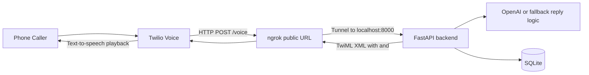

# AI Receptionist Full Stack MVP

Twilio + FastAPI backend with:
- OpenAI response generation
- structured intent detection
- basic multi-tenant business lookup
- persistent per-call session state
- SQLite logging via SQLAlchemy
- basic appointment capture
- health check
- business profile config

Next.js dashboard with:
- onboarding form
- calls table
- settings page
- simple overview cards

## Architecture

The backend does not connect to ngrok directly. `ngrok` is a separate local process that exposes your local FastAPI server to the public internet so Twilio can reach it.



Runtime responsibilities:
- Twilio handles the phone call, speech capture, and text-to-speech playback.
- `ngrok` only forwards public webhook traffic to your local machine.
- FastAPI handles `/voice`, generates the reply text, and logs call data.
- The AI layer returns structured receptionist results with `intent`, `state`, `response`, and `fields`.
- SQLite stores businesses, call logs, appointment requests, and call sessions.
- OpenAI generates the receptionist response when `OPENAI_API_KEY` is configured; otherwise the app uses fallback logic.

Code locations:
- Twilio webhook and TwiML generation: [`backend/app/main.py`](backend/app/main.py)
- Reply generation and intent detection: [`backend/app/ai.py`](backend/app/ai.py)
- Database connection: [`backend/app/db.py`](backend/app/db.py)
- Models: [`backend/app/models.py`](backend/app/models.py)

Multi-business resolution:
- The backend checks the incoming Twilio `To` number on `POST /voice`.
- If a `businesses` row matches that number, the app uses that business's `greeting`, `business_hours`, `booking_enabled`, and `knowledge_text`.
- If no row matches, the app falls back to the env-backed defaults from `backend/app/config.py`.

Session state:
- Each Twilio call is keyed by `CallSid` in the `call_sessions` table.
- On each `POST /voice`, the backend loads or creates the session, appends the latest user utterance, calls the AI layer with the existing session context, and saves the assistant reply plus updated session state.
- `slot_data_json` stores collected values such as `appointment_day`, `appointment_time`, and `callback_number`.
- `transcript_json` stores the recent call transcript so booking flows can continue across turns.

## 1) Backend setup

```bash
cd backend
python -m venv .venv
source .venv/bin/activate
pip install -r requirements.txt
cp .env.example .env
uvicorn app.main:app --reload --port 8000
```

For LLM mode, edit `backend/.env` before starting the server and set a real OpenAI API key:

```env
OPENAI_API_KEY=your_real_openai_api_key
OPENAI_MODEL=gpt-4o-mini
BUSINESS_NAME=Bright Smile Dental
BUSINESS_GREETING=Hello, thanks for calling Bright Smile Dental. How can I help you today?
BUSINESS_HOURS=Mon-Fri 9 AM to 5 PM
BOOKING_ENABLED=true
DATABASE_URL=sqlite:///./receptionist.db
```

Behavior:
- If `OPENAI_API_KEY` is present, the receptionist uses the OpenAI chat model and expects structured JSON output like:

```json
{
  "intent": "BOOK_APPOINTMENT",
  "state": "COLLECTING_APPOINTMENT_TIME",
  "response": "Sure, I can help schedule that. What day and time works for you?",
  "fields": {}
}
```

- Supported intents are `BOOK_APPOINTMENT`, `BUSINESS_HOURS`, `CALLBACK_REQUEST`, and `GENERAL_QUESTION`.
- If `OPENAI_API_KEY` is missing or the OpenAI request fails, the backend falls back to simple rule-based intent detection and short canned replies.
- Business profile data is resolved from the `businesses` table first, with `.env` fallback defaults when no business row matches.
- The `state` value is persisted so the next `/voice` turn can continue from the prior step instead of restarting.

## 2) Expose locally to Twilio

```bash
ngrok http 8000
```

This command is not run by the app. Start it manually in a separate terminal after the FastAPI server is already running.

Set your Twilio phone number voice webhook to:

```text
https://YOUR-NGROK-URL/voice
```

## 3) Frontend setup

```bash
cd frontend
cp .env.local.example .env.local
npm install
npm run dev
```

Open:
- Frontend: http://localhost:3000
- Backend docs: http://localhost:8000/docs

## 4) Important env vars

Backend `.env`:
- `OPENAI_API_KEY` required for real LLM mode
- `OPENAI_MODEL=gpt-4o-mini`
- `BUSINESS_NAME=Bright Smile Dental`
- `BUSINESS_GREETING=Hello, thanks for calling Bright Smile Dental. How can I help you today?`
- `BUSINESS_HOURS=Mon-Fri 9 AM to 5 PM`
- `BOOKING_ENABLED=true`
- `DATABASE_URL=sqlite:///./receptionist.db`

Frontend `.env.local`:
- `NEXT_PUBLIC_API_BASE_URL=http://localhost:8000`

## 5) Notes

- This MVP uses SQLite at `backend/receptionist.db`.
- Multi-tenant mode is basic: one incoming Twilio number maps to one business record.
- Call sessions are persisted locally in SQLite and keyed by `CallSid`.
- Business names, greetings, hours, booking settings, and knowledge text are stored in the database, with env-backed fallback defaults if no business matches.
- Appointment booking is intentionally simple: it captures requested time and caller info.
- The Twilio voice webhook contract remains `POST /voice`.
- The receptionist is LLM-first when `OPENAI_API_KEY` is configured.
- Booking and callback intents create a simple database entry in `appointment_requests`.
- Call logs store `business_id`, `detected_intent`, and structured `intent_data`.
- Appointment requests now store `business_id`.
- For production, replace SQLite with Postgres and add real calendar integration.
- Twilio Gather speech handling is implemented in `/voice`.

Example 3-turn booking flow:
1. Caller: `I want to book an appointment`
   Assistant: `Sure, I can help schedule that. What day works for you?`
   Session state: `COLLECTING_APPOINTMENT_DAY`
2. Caller: `Tuesday`
   Assistant: `What time works best for you?`
   Session state: `COLLECTING_APPOINTMENT_TIME`
3. Caller: `3 pm, and my number is 555-111-2222`
   Assistant: `Thanks. I have your day, time, and callback number. We will follow up shortly.`
   Session state: `BOOKING_COMPLETE`

## 6) Create A Demo Business

Create a demo business row for local testing:

```bash
curl -X POST "http://127.0.0.1:8000/api/demo-business?twilio_number=%2B15550001111&forwarding_number=%2B15550002222"
```

Then point your Twilio phone number or test request to use `To=+15550001111`. The webhook will resolve that business and use its greeting and business settings.

The onboarding page at `http://localhost:3000/onboarding` now posts directly to `POST /api/businesses`.

You can also create businesses directly:

```bash
curl -X POST http://127.0.0.1:8000/api/businesses \
  -H "Content-Type: application/json" \
  -d '{
    "name": "Bright Smile Dental",
    "twilio_number": "+15550001111",
    "forwarding_number": "+15550002222",
    "greeting": "Hello, thanks for calling Bright Smile Dental. How can I help you today?",
    "business_hours": "Mon-Fri 9 AM to 5 PM",
    "booking_enabled": true,
    "knowledge_text": "We offer cleanings, exams, and follow-up visits."
  }'
```

## 7) Suggested next upgrades
- Google Calendar integration
- Stripe billing
- multi-tenant business configs
- Twilio request validation
- role-based auth

## 8) Backend Tests

Install backend dependencies into the backend virtualenv:

```bash
cd backend
python -m venv .venv
source .venv/bin/activate
pip install -r requirements.txt
```

Run the backend test suite:

```bash
backend/.venv/bin/python -m pytest backend/tests -q
```

Run the backend test suite with coverage:

```bash
backend/.venv/bin/python -m pytest backend/tests \
  --cov=backend/app \
  --cov-report=term-missing
```

Current backend coverage target is measured against `backend/app`.
