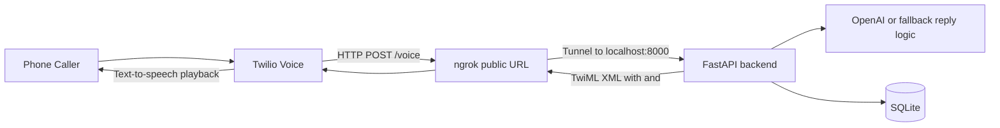

# AI Receptionist Full Stack MVP

Twilio + FastAPI backend with:
- OpenAI response generation
- SQLite logging via SQLAlchemy
- basic appointment capture
- health check
- business profile config

Next.js dashboard with:
- onboarding form
- calls table
- settings page
- simple overview cards

## Architecture

The backend does not connect to ngrok directly. `ngrok` is a separate local process that exposes your local FastAPI server to the public internet so Twilio can reach it.



Runtime responsibilities:
- Twilio handles the phone call, speech capture, and text-to-speech playback.
- `ngrok` only forwards public webhook traffic to your local machine.
- FastAPI handles `/voice`, generates the reply text, and logs call data.
- SQLite stores call logs and appointment requests.
- OpenAI generates the receptionist response when `OPENAI_API_KEY` is configured; otherwise the app uses fallback logic.

Code locations:
- Twilio webhook and TwiML generation: [`backend/app/main.py`](backend/app/main.py)
- Reply generation and intent detection: [`backend/app/ai.py`](backend/app/ai.py)
- Database connection: [`backend/app/db.py`](backend/app/db.py)
- Models: [`backend/app/models.py`](backend/app/models.py)

## 1) Backend setup

```bash
cd backend
python -m venv .venv
source .venv/bin/activate
pip install -r requirements.txt
cp .env.example .env
uvicorn app.main:app --reload --port 8000
```

For LLM mode, edit `backend/.env` before starting the server and set a real OpenAI API key:

```env
OPENAI_API_KEY=your_real_openai_api_key
OPENAI_MODEL=gpt-4o-mini
BUSINESS_NAME=Bright Smile Dental
BUSINESS_GREETING=Hello, thanks for calling Bright Smile Dental. How can I help you today?
BUSINESS_HOURS=Mon-Fri 9 AM to 5 PM
BOOKING_ENABLED=true
DATABASE_URL=sqlite:///./receptionist.db
```

Behavior:
- If `OPENAI_API_KEY` is present, the receptionist uses the OpenAI chat model by default.
- If `OPENAI_API_KEY` is missing or the OpenAI request fails, the backend returns a short fallback receptionist reply.

## 2) Expose locally to Twilio

```bash
ngrok http 8000
```

This command is not run by the app. Start it manually in a separate terminal after the FastAPI server is already running.

Set your Twilio phone number voice webhook to:

```text
https://YOUR-NGROK-URL/voice
```

## 3) Frontend setup

```bash
cd frontend
cp .env.local.example .env.local
npm install
npm run dev
```

Open:
- Frontend: http://localhost:3000
- Backend docs: http://localhost:8000/docs

## 4) Important env vars

Backend `.env`:
- `OPENAI_API_KEY` required for real LLM mode
- `OPENAI_MODEL=gpt-4o-mini`
- `BUSINESS_NAME=Bright Smile Dental`
- `BUSINESS_GREETING=Hello, thanks for calling Bright Smile Dental. How can I help you today?`
- `BUSINESS_HOURS=Mon-Fri 9 AM to 5 PM`
- `BOOKING_ENABLED=true`
- `DATABASE_URL=sqlite:///./receptionist.db`

Frontend `.env.local`:
- `NEXT_PUBLIC_API_BASE_URL=http://localhost:8000`

## 5) Notes

- This MVP uses SQLite at `backend/receptionist.db`.
- Appointment booking is intentionally simple: it captures requested time and caller info.
- The Twilio voice webhook contract remains `POST /voice`.
- The receptionist is LLM-first when `OPENAI_API_KEY` is configured.
- For production, replace SQLite with Postgres and add real calendar integration.
- Twilio Gather speech handling is implemented in `/voice`.

## 6) Suggested next upgrades
- Google Calendar integration
- Stripe billing
- multi-tenant business configs
- Twilio request validation
- role-based auth
