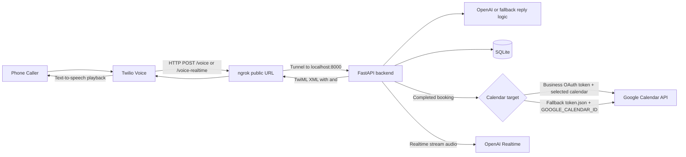

# AI Receptionist Full Stack MVP

Twilio + FastAPI backend with:
- OpenAI response generation
- structured intent detection
- basic multi-tenant business lookup
- Twilio signature validation
- config-driven CORS
- optional Google Calendar booking
- persistent per-call session state
- SQLite logging via SQLAlchemy
- basic appointment capture
- health check
- business profile config

Next.js dashboard with:
- onboarding form
- calls table
- settings page
- simple overview cards

## Worktrees

This repo uses Git worktrees for day-to-day development:

- backend worktree: `/Users/viplavfauzdar/Projects/ai_receptionist_backend`
- frontend worktree: `/Users/viplavfauzdar/Projects/ai_receptionist_frontend`
- main checkout: `/Users/viplavfauzdar/Projects/ai_receptionist`

Recommended usage:

- do backend changes from the backend worktree
- do frontend changes from the frontend worktree
- confirm the current directory and branch at the start of a new session

## Architecture

The backend does not connect to ngrok directly. `ngrok` is a separate local process that exposes your local FastAPI server to the public internet so Twilio can reach it.



Runtime responsibilities:
- Twilio handles the phone call, speech capture, and text-to-speech playback.
- `ngrok` only forwards public webhook traffic to your local machine.
- FastAPI handles `/voice`, generates the reply text, and logs call data.
- The AI layer returns structured receptionist results with `intent`, `state`, `response`, and `fields`.
- SQLite stores businesses, call logs, appointment requests, and call sessions.
- OpenAI generates the receptionist response when `OPENAI_API_KEY` is configured; otherwise the app uses fallback logic.
- `/voice` validates the Twilio signature by default before processing the webhook.
- Google Calendar booking targets the connected business calendar first. If a business has not completed Google OAuth onboarding, the backend falls back to the local `token.json` account and `GOOGLE_CALENDAR_ID`, which defaults to `primary`.

Code locations:
- Twilio webhook and TwiML generation: [`backend/app/main.py`](backend/app/main.py)
- Reply generation and intent detection: [`backend/app/ai.py`](backend/app/ai.py)
- Prompt template: [`backend/app/skills/receptionist_system_prompt.md`](backend/app/skills/receptionist_system_prompt.md)
- Database connection: [`backend/app/db.py`](backend/app/db.py)
- Models: [`backend/app/models.py`](backend/app/models.py)

Multi-business resolution:
- The backend checks the incoming Twilio `To` number on `POST /voice`.
- Business phone numbers are normalized into a digit-only lookup field and resolved through an indexed query instead of a table scan.
- If a `businesses` row matches that number, the app uses that business's `greeting`, `business_hours`, `booking_enabled`, and `knowledge_text`.
- If no row matches, the app falls back to the env-backed defaults from `backend/app/config.py`.

Session state:
- Each Twilio call is keyed by `CallSid` in the `call_sessions` table.
- On each `POST /voice`, the backend loads or creates the session, appends the latest user utterance, calls the AI layer with the existing session context, and saves the assistant reply plus updated session state.
- `slot_data_json` stores collected values such as `appointment_day`, `appointment_time`, `callback_number`, and `caller_name`.
- `transcript_json` stores the recent call transcript so booking flows can continue across turns.

## 1) Backend setup

```bash
cd backend
python -m venv .venv
source .venv/bin/activate
pip install -r requirements.txt
cp .env.example .env
uvicorn app.main:app --reload --port 8000
```

For LLM mode, edit `backend/.env` before starting the server and set a real OpenAI API key:

```env
OPENAI_API_KEY=your_real_openai_api_key
OPENAI_MODEL=gpt-4o-mini
ENABLE_STREAMING_VOICE_EXPERIMENT=false
STREAMING_WS_PATH=/ws/media-stream
STREAMING_VOICE_ROUTE=/voice-stream
ENABLE_CONVERSATION_RELAY_EXPERIMENT=false
CONVERSATION_RELAY_ROUTE=/voice-relay
ENABLE_OPENAI_REALTIME_EXPERIMENT=false
OPENAI_REALTIME_ROUTE=/voice-realtime
OPENAI_REALTIME_WS_PATH=/ws/openai-realtime
OPENAI_REALTIME_MODEL=gpt-realtime
OPENAI_REALTIME_VOICE=marin
ENABLE_REALTIME_BARGE_IN=false
REALTIME_TURN_DETECTION_TYPE=semantic_vad
STREAMING_STT_BUFFER_BYTES=32000
MAX_CALL_TURNS=12
MAX_LLM_CALLS_PER_SESSION=6
ENABLE_BASIC_RATE_LIMITING=true
MAX_NEW_CALLS_PER_NUMBER_PER_HOUR=5
GOOGLE_CALENDAR_ENABLED=true
GOOGLE_CALENDAR_ID=primary
GOOGLE_CLIENT_SECRETS_FILE=./credentials.json
GOOGLE_TOKEN_FILE=./token.json
GOOGLE_OAUTH_REDIRECT_URI=http://127.0.0.1:8000/api/integrations/google/callback
GOOGLE_TIMEZONE=America/New_York
APPOINTMENT_DURATION_MINUTES=30
TWILIO_AUTH_TOKEN=your_real_twilio_auth_token
DISABLE_TWILIO_SIGNATURE_VALIDATION=false
CORS_ALLOWED_ORIGINS=http://localhost:3000,http://127.0.0.1:3000
BUSINESS_NAME=Bright Smile Dental
BUSINESS_GREETING=Hello, thanks for calling Bright Smile Dental. How can I help you today?
BUSINESS_HOURS=Mon-Fri 9 AM to 5 PM
BOOKING_ENABLED=true
DATABASE_URL=sqlite:///./receptionist.db
```

Behavior:
- If `OPENAI_API_KEY` is present, the receptionist uses the OpenAI chat model and expects structured JSON output like:

```json
{
  "intent": "BOOK_APPOINTMENT",
  "state": "COLLECTING_APPOINTMENT_TIME",
  "response": "Sure, I can help schedule that. What day and time works for you?",
  "fields": {}
}
```

- Supported intents are `BOOK_APPOINTMENT`, `BUSINESS_HOURS`, `CALLBACK_REQUEST`, and `GENERAL_QUESTION`.
- If `OPENAI_API_KEY` is missing or the OpenAI request fails, the backend falls back to simple rule-based intent detection and short canned replies.
- Business profile data is resolved from the `businesses` table first, with `.env` fallback defaults when no business row matches.
- The `state` value is persisted so the next `/voice` turn can continue from the prior step instead of restarting.
- The main receptionist system prompt now lives in `backend/app/skills/receptionist_system_prompt.md` and is loaded by `backend/app/ai.py` at runtime.
- The prompt loader interpolates business values such as `business_name` and `business_hours`.
- If the prompt file is missing or unreadable, the backend falls back to a built-in default prompt so `/voice` does not break.
- Model output is validated and sanitized before the `/voice` route uses it, so malformed JSON, missing fields, invalid intent/state values, empty content, and timeout/error cases all recover to a safe fallback response instead of breaking the Twilio flow.
- The backend validates the `X-Twilio-Signature` header by default. For local development behind `ngrok`, you can temporarily set `DISABLE_TWILIO_SIGNATURE_VALIDATION=true`.
- CORS is restricted by `CORS_ALLOWED_ORIGINS`; the default allows only local frontend origins.
- The existing `POST /voice` TwiML flow remains the primary production path.
- A separate experimental streaming path now exists via `POST /voice-stream` plus WebSocket media streaming on `/ws/media-stream`. It is isolated from the current booking and TwiML flow and is intended for lower-latency future work.
- A separate experimental ConversationRelay path now exists via `POST /voice-relay` plus WebSocket events on `/ws/conversation-relay`. It is disabled by default with `ENABLE_CONVERSATION_RELAY_EXPERIMENT=false`.
- A separate experimental full-duplex skeleton now exists via `POST /voice-duplex` plus WebSocket media streaming on `/ws/voice-duplex`. It is intentionally separate from `/voice`, `/voice-stream`, and `/voice-relay`.
- A separate experimental OpenAI Realtime bridge now exists via `POST /voice-realtime` plus WebSocket media streaming on `/ws/openai-realtime`. It is intentionally separate from the `/voice-duplex` skeleton and disabled by default.
- Abuse protections are config-driven: `MAX_CALL_TURNS` ends runaway sessions cleanly, `MAX_LLM_CALLS_PER_SESSION` stops repeated model calls and switches to deterministic fallback, and `ENABLE_BASIC_RATE_LIMITING` plus `MAX_NEW_CALLS_PER_NUMBER_PER_HOUR` throttle repeated new calls from the same caller number.
- If Twilio sends a malformed `/voice` webhook without required identifiers such as `CallSid` or `From`, the backend returns a short TwiML apology and ends the call instead of crashing.
- Silence handling is deterministic: the first silent turn gets a polite reprompt, the second gets a shorter fallback prompt, and the third ends the call cleanly.
- When Google Calendar is enabled and a booking is complete, the backend creates a real calendar event and confirms it to the caller. If calendar creation fails, the request is still saved and the caller gets a fallback confirmation.
- Google Calendar onboarding is business-linked: a business can connect its own Google account through backend OAuth routes, store its token on the business row, list available calendars, and select which calendar receives bookings.
- Calendar selection order is business first, fallback second. The runtime uses `business.google_token_json` plus `business.google_calendar_id` when present; otherwise it uses the legacy local `GOOGLE_TOKEN_FILE` account with `GOOGLE_CALENDAR_ID=primary` by default.
- Before creating the Google Calendar event, the backend checks the requested window for conflicts. If the slot overlaps an existing active event, the backend does not create the event and asks the caller for another time.
- When the calendar service can infer a nearby opening after the conflicting event chain, the receptionist offers that suggested slot in the spoken response.

## 2) Expose locally to Twilio

```bash
ngrok http 8000
```

This command is not run by the app. Start it manually in a separate terminal after the FastAPI server is already running.

Set your Twilio phone number voice webhook to:

```text
https://YOUR-NGROK-URL/voice
```

## 3) Frontend setup

```bash
cd frontend
cp .env.local.example .env.local
npm install
npm run dev
```

Open:
- Frontend: http://localhost:3000
- Backend docs: http://localhost:8000/docs

## 4) Important env vars

Backend `.env`:
- `OPENAI_API_KEY` required for real LLM mode
- `OPENAI_MODEL=gpt-4o-mini`
- `ENABLE_STREAMING_VOICE_EXPERIMENT=false`
- `STREAMING_WS_PATH=/ws/media-stream`
- `STREAMING_VOICE_ROUTE=/voice-stream`
- `ENABLE_CONVERSATION_RELAY_EXPERIMENT=false`
- `CONVERSATION_RELAY_ROUTE=/voice-relay`
- `ENABLE_OPENAI_REALTIME_EXPERIMENT=false`
- `OPENAI_REALTIME_ROUTE=/voice-realtime`
- `OPENAI_REALTIME_WS_PATH=/ws/openai-realtime`
- `OPENAI_REALTIME_MODEL=gpt-realtime`
- `OPENAI_REALTIME_VOICE=marin`
- `ENABLE_REALTIME_BARGE_IN=false`
- `REALTIME_TURN_DETECTION_TYPE=semantic_vad`
- `STREAMING_STT_BUFFER_BYTES=32000`
- `MAX_CALL_TURNS=12`
- `MAX_LLM_CALLS_PER_SESSION=6`
- `ENABLE_BASIC_RATE_LIMITING=true`
- `MAX_NEW_CALLS_PER_NUMBER_PER_HOUR=5`
- `GOOGLE_CALENDAR_ENABLED=true`
- `GOOGLE_CALENDAR_ID=primary`
- `GOOGLE_CLIENT_SECRETS_FILE=./credentials.json`
- `GOOGLE_TOKEN_FILE=./token.json`
- `GOOGLE_OAUTH_REDIRECT_URI=http://127.0.0.1:8000/api/integrations/google/callback`
- `GOOGLE_TIMEZONE=America/New_York`
- `APPOINTMENT_DURATION_MINUTES=30`
- `TWILIO_AUTH_TOKEN` required for production webhook validation
- `DISABLE_TWILIO_SIGNATURE_VALIDATION=false`
- `CORS_ALLOWED_ORIGINS=http://localhost:3000,http://127.0.0.1:3000`
- `BUSINESS_NAME=Bright Smile Dental`
- `BUSINESS_GREETING=Hello, thanks for calling Bright Smile Dental. How can I help you today?`
- `BUSINESS_HOURS=Mon-Fri 9 AM to 5 PM`
- `BOOKING_ENABLED=true`
- `DATABASE_URL=sqlite:///./receptionist.db`

Frontend `.env.local`:
- `NEXT_PUBLIC_API_BASE_URL=http://localhost:8000`

## 5) Notes

- This MVP uses SQLite at `backend/receptionist.db`.
- Multi-tenant mode is basic: one incoming Twilio number maps to one business record.
- Business lookup is normalized and indexed through `businesses.twilio_number_normalized`.
- Call sessions are persisted locally in SQLite and keyed by `CallSid`.
- Business names, greetings, hours, booking settings, and knowledge text are stored in the database, with env-backed fallback defaults if no business matches.
- Appointment booking is intentionally simple: it only persists when the flow is complete enough to save.
- Booking requests are saved only after `appointment_day`, `appointment_time`, `callback_number`, and `caller_name` are present.
- Callback requests are saved only after `callback_number` and `caller_name` are present.
- Call sessions also track `turn_count`, `llm_call_count`, and `last_protection_reason` to stop runaway loops and excessive model usage.
- The Twilio voice webhook contract remains `POST /voice`.
- The experimental streaming webhook is separate at `POST /voice-stream` and does not replace the main `/voice` flow.
- The experimental ConversationRelay webhook is separate at `POST /voice-relay` and does not replace `/voice` or `/voice-stream`.
- The experimental full-duplex webhook is separate at `POST /voice-duplex` and does not replace `/voice`, `/voice-stream`, or `/voice-relay`.
- The experimental OpenAI Realtime webhook is separate at `POST /voice-realtime` and does not replace `/voice`, `/voice-stream`, `/voice-relay`, or `/voice-duplex`.
- The receptionist is LLM-first when `OPENAI_API_KEY` is configured.
- Booking and callback intents create a simple database entry in `appointment_requests`.
- Call logs store `business_id`, `detected_intent`, and structured `intent_data`.
- Appointment requests now store `business_id`.
- Business rows now persist Google onboarding state through `google_calendar_connected`, `google_account_email`, `google_calendar_id`, and `google_token_json`.
- The receptionist now asks for caller name before finalizing a booking or callback request.
- For production, replace SQLite with Postgres and add real calendar integration.
- Twilio Gather speech handling is implemented in `/voice` with `speech_timeout="auto"`, `timeout=3`, and `action_on_empty_result=True`.
- Silent turns are tracked in session slot data with a small `silence_count` so the call does not fall into redirect loops.
- If a session exceeds `MAX_CALL_TURNS`, the backend returns a short goodbye and hangs up.
- If a session exceeds `MAX_LLM_CALLS_PER_SESSION`, the backend stops invoking OpenAI for that call and uses the deterministic fallback flow instead.
- If basic rate limiting is enabled and a caller starts too many new calls within an hour, the backend returns a polite rate-limit message and hangs up without creating a new session.
- Protection triggers are logged in `call_logs.protection_reason` with values such as `turn_limit_exceeded`, `llm_limit_exceeded`, `caller_rate_limited`, and `malformed_request`.
- If Google Calendar booking is enabled, successful bookings persist `calendar_event_id`, `calendar_event_link`, `scheduled_start`, and `scheduled_end` on `appointment_requests`.
- Calendar conflict detection ignores cancelled events.
- Overlap rule: any real interval intersection blocks the slot, but an appointment that starts exactly when a prior event ends is allowed.

## 6A) Experimental Streaming Voice Path

This is an isolated parallel path for future lower-latency voice using Twilio bidirectional Media Streams.

- Twilio webhook: `POST /voice-stream`
- WebSocket endpoint: `/ws/media-stream`
- TwiML uses `<Connect><Stream>` so Twilio opens one bidirectional WebSocket per call
- `/voice-stream` no longer uses TwiML `<Say>` for the greeting; after the WebSocket `start` event the backend sends the initial business-aware greeting through the same outbound TTS/media path used for assistant replies, so the voice stays consistent
- current implementation decodes inbound Twilio mu-law frames, converts them to PCM, upsamples from 8kHz to 16kHz, buffers short chunks for STT, and passes any transcript text into the existing assistant logic on a deterministic fallback path
- transcript generation is handled by the OpenAI transcription API through `backend/app/streaming/stt_adapter.py`, using `STREAMING_STT_MODEL` and the existing `OPENAI_API_KEY`
- audio is decoded from Twilio base64 mu-law, converted to mono PCM16, resampled from 8kHz to 16kHz, wrapped as a mono 16-bit 16kHz WAV, and only sent to STT once about 1 second of PCM audio is buffered (`32000` bytes)
- the STT threshold is configurable with `STREAMING_STT_BUFFER_BYTES`; the current default is `32000` bytes of 16kHz PCM16
- inbound media is temporarily gated from STT while outbound TTS audio is being played, to reduce self-transcription and repeated fallback replies
- if the caller hangs up with buffered audio still waiting below threshold, the route performs one final STT flush on the Twilio `stop` event before the stream session closes
- if transcription fails, the chunk is discarded, the error is logged, and the WebSocket session stays alive
- reply text is sent through `backend/app/streaming/tts_adapter.py`, synthesized to PCM, converted to Twilio-compatible mono 8kHz mu-law audio, base64 encoded, and returned over the bidirectional stream as outbound `media` messages
- if TTS fails, the error is logged and the WebSocket session stays alive
- short booking phrases in the streaming path such as `3 PM`, `Thursday`, `Thursday at 4`, and `tomorrow at 3 PM` now normalize into booking slots so the conversation advances instead of repeating the same question
- if the streaming booking bridge would repeat the same collection question twice in a row, it switches to a more explicit reprompt such as `I didn't catch the time. You can say something like 3 PM.`
- callback number collection in the streaming path now normalizes phone-audio variants such as `678 462 4453`, `678-462-4453`, `6 7 8 4 6 2 4 4 5 3`, and `six seven eight four six two four four five three` into a deterministic digit string so the booking flow advances once a valid number is captured
- when callback digits arrive across multiple transcripts, the streaming path now accumulates them in a small per-session digit buffer while the state is `COLLECTING_CALLBACK_NUMBER`, so callers do not need to speak all 10 digits in one utterance
- if callback number collection would repeat the same question twice in a row, the streaming bridge now uses `I didn't catch the number. You can say it digit by digit, like 678 462 4453.`
- the current `/voice` path remains the primary path and is unchanged

Implementation lives under:
- `backend/app/streaming/routes.py`
- `backend/app/streaming/session.py`
- `backend/app/streaming/voice.py`
- `backend/app/streaming/stt_adapter.py`
- `backend/app/streaming/tts_adapter.py`

To test the experimental path locally:

1. Set in `backend/.env`:

```env
ENABLE_STREAMING_VOICE_EXPERIMENT=true
STREAMING_VOICE_ROUTE=/voice-stream
STREAMING_WS_PATH=/ws/media-stream
```

2. Restart the backend.
3. Point a Twilio phone number’s voice webhook at:

```text
https://YOUR-NGROK-URL/voice-stream
```

4. Twilio will receive TwiML with `<Connect><Stream>` and then connect to:

```text
wss://YOUR-NGROK-URL/ws/media-stream
```

This path is now a minimal full loop: inbound Twilio audio, transcript generation, reply text generation, and outbound streamed speech. It is still experimental and does not replace the main receptionist flow yet.

## 6B) Experimental ConversationRelay Path

This is an isolated parallel proof-of-concept using Twilio ConversationRelay.

- Twilio webhook: `POST /voice-relay`
- WebSocket endpoint: `/ws/conversation-relay`
- Enable with `ENABLE_CONVERSATION_RELAY_EXPERIMENT=true`
- Configure the route with `CONVERSATION_RELAY_ROUTE=/voice-relay`
- TwiML uses `<Connect><ConversationRelay>` so Twilio handles STT and TTS and sends structured transcript events to the backend WebSocket
- the route returns a safe TwiML error and hangs up while the experiment flag is disabled
- the relay WebSocket handles `setup`, final `prompt`, `dtmf`, `interrupt`, and `error` messages
- final caller transcripts reuse the existing receptionist response logic, appointment state, calendar booking checks, and database logging path used by the main voice flow
- relay booking prompts are shaped to sound more like a front desk receptionist, asking for day and time together first and using short state-specific repair prompts when details are missing
- relay logs use the `[conversation-relay]` prefix and include session start, user transcript, assistant response, tool/state transitions, relay errors, and session end

Twilio webhook config for this experiment:

```text
Voice webhook URL: https://YOUR-NGROK-URL/voice-relay
HTTP method: POST
WebSocket opened by TwiML: wss://YOUR-NGROK-HOST/ws/conversation-relay
```

## 6C) Experimental Full-Duplex Voice Skeleton

This is an isolated architecture skeleton for true full-duplex voice using Twilio Media Streams.

- Twilio webhook: `POST /voice-duplex`
- WebSocket endpoint: `/ws/voice-duplex`
- TwiML uses `<Connect><Stream>` and points Twilio to `wss://YOUR-NGROK-HOST/ws/voice-duplex`
- implementation lives under `backend/app/duplex/`
- runtime stages are separated into inbound audio receiving, STT, agent response generation, TTS sending, and interruption handling
- `asyncio.Queue` boundaries connect audio frames, transcripts, agent responses, outbound Twilio messages, and interruption events
- session states are `IDLE`, `LISTENING`, `THINKING`, `SPEAKING`, and `INTERRUPTED`
- barge-in is a skeleton: while `SPEAKING`, inbound audio energy can cancel the current TTS task, send Twilio `{"event":"clear","streamSid":"..."}`, and return to `LISTENING`
- provider interfaces are pluggable through `StreamingSTTProvider` and `StreamingTTSProvider`
- current providers are stubs; Deepgram, OpenAI Realtime, ElevenLabs, or other streaming vendors still need real adapters
- this path makes no production claim and does not change the current `/voice`, `/voice-stream`, or `/voice-relay` behavior

## 6D) Experimental OpenAI Realtime Bridge

This is an isolated proof-of-concept bridge from Twilio Media Streams to OpenAI Realtime.

- Twilio webhook: `POST /voice-realtime`
- WebSocket endpoint: `/ws/openai-realtime`
- Enable with `ENABLE_OPENAI_REALTIME_EXPERIMENT=true`
- Configure with `OPENAI_REALTIME_ROUTE=/voice-realtime` and `OPENAI_REALTIME_WS_PATH=/ws/openai-realtime`
- Realtime model and voice come from `OPENAI_REALTIME_MODEL` and `OPENAI_REALTIME_VOICE`; the default Realtime voice is `marin`
- Realtime turn detection defaults to `REALTIME_TURN_DETECTION_TYPE=semantic_vad`
- TwiML uses `<Connect><Stream>` and points Twilio to `wss://YOUR-NGROK-HOST/ws/openai-realtime`
- the bridge connects to the current OpenAI Realtime WebSocket endpoint with `Authorization` only, sends a GA-shaped `session.update` using nested `audio.input.format.type` and `audio.output.format.type` set to `audio/pcmu`, enables input audio transcription with `STREAMING_STT_MODEL`, forwards Twilio inbound G.711 mu-law audio as Realtime input audio, and directly forwards Realtime `audio/pcmu` deltas back to Twilio as `media`
- Realtime uses model-managed turn taking with `semantic_vad` and `create_response=true`; OpenAI detects end-of-turn and creates responses without the bridge waiting for `transcription.completed`
- this avoids silence caused by unreliable transcript-gated response creation and feels more conversational than IVR-style manual turn handling
- final audio flow: Twilio `audio/pcmu` payload -> OpenAI `input_audio_buffer.append` -> OpenAI Realtime `semantic_vad` -> automatic model response -> OpenAI `audio/pcmu` delta -> Twilio `media.payload` direct forward
- direct audio forwarding is required: do not decode or re-encode OpenAI audio deltas, do not resample, and do not convert PCM; `audio/pcmu` deltas go directly to Twilio `media.payload`
- Realtime tool-call boundaries exist for `lookup_business`, `check_availability`, `create_booking`, `capture_callback`, and `log_call_summary`
- Realtime instructions are conversational rather than scripted IVR: short front-desk replies, date and time together for booking, minimal repeated confirmations, and no repeated greeting after the first turn
- current tool handlers are stubs; they are structured so later patches can call existing business lookup, calendar, booking, callback, and call-log logic
- barge-in cancellation is disabled by default with `ENABLE_REALTIME_BARGE_IN=false`; when enabled, barge-in is based on OpenAI `input_audio_buffer.speech_started` events, never raw Twilio media frames
- repeated cancellations usually mean barge-in is being triggered from the wrong signal; raw Twilio media frames arrive continuously and include silence/noise
- protocol-sensitive Realtime message shapes are isolated in `backend/app/realtime/bridge.py`; the bridge does not send the deprecated `OpenAI-Beta` header
- this path makes no production claim and does not change `/voice`, `/voice-stream`, `/voice-relay`, or `/voice-duplex`

Troubleshooting:

- Static usually means an audio format mismatch. Twilio expects G.711 mu-law, so Realtime input/output should be `audio/pcmu` and output deltas should be forwarded unchanged.
- Silence after the greeting usually means response creation or turn gating is wrong. The working path uses `semantic_vad` with `create_response=true`.
- Rambling usually means VAD auto-response is firing too aggressively or the prompt is over-eager. Tune turn detection and keep the receptionist instructions explicit about waiting for the caller.
- Repeated cancellations usually mean bad barge-in logic. Barge-in should come from OpenAI `input_audio_buffer.speech_started`, not raw Twilio `media` frames.

Required backend env vars:

```env
ENABLE_OPENAI_REALTIME_EXPERIMENT=true
OPENAI_REALTIME_ROUTE=/voice-realtime
OPENAI_REALTIME_WS_PATH=/ws/openai-realtime
OPENAI_REALTIME_MODEL=gpt-realtime
OPENAI_REALTIME_VOICE=marin
ENABLE_REALTIME_BARGE_IN=false
REALTIME_TURN_DETECTION_TYPE=semantic_vad
OPENAI_API_KEY=your_real_openai_api_key
```

Twilio webhook config:

```text
Voice webhook URL: https://YOUR-NGROK-URL/voice-realtime
HTTP method: POST
WebSocket opened by TwiML: wss://YOUR-NGROK-HOST/ws/openai-realtime
```

Example 3-turn booking flow:
1. Caller: `I want to book an appointment`
   Assistant: `Sure, I can help schedule that. What day works for you?`
   Session state: `COLLECTING_APPOINTMENT_DAY`
2. Caller: `Tuesday`
   Assistant: `What time works best for you?`
   Session state: `COLLECTING_APPOINTMENT_TIME`
3. Caller: `3 pm, and my number is 555-111-2222`
   Assistant: `What name should I put on that request?`
   Session state: `COLLECTING_CALLER_NAME`
4. Caller: `Jane Smith`
   Assistant: `Thanks. I have your day, time, and callback number as 5 5 5, 1 1 1, 2 2 2 2. We will follow up shortly.`
   Session state: `BOOKING_COMPLETE`

## 6) Create A Demo Business

Create a demo business row for local testing:

```bash
curl -X POST "http://127.0.0.1:8000/api/demo-business?twilio_number=%2B15550001111&forwarding_number=%2B15550002222"
```

Then point your Twilio phone number or test request to use `To=+15550001111`. The webhook will resolve that business and use its greeting and business settings.

The onboarding page at `http://localhost:3000/onboarding` now posts directly to `POST /api/businesses`.

You can also create businesses directly:

```bash
curl -X POST http://127.0.0.1:8000/api/businesses \
  -H "Content-Type: application/json" \
  -d '{
    "name": "Bright Smile Dental",
    "twilio_number": "+15550001111",
    "forwarding_number": "+15550002222",
    "greeting": "Hello, thanks for calling Bright Smile Dental. How can I help you today?",
    "business_hours": "Mon-Fri 9 AM to 5 PM",
    "booking_enabled": true,
    "knowledge_text": "We offer cleanings, exams, and follow-up visits."
  }'
```

## 7) Suggested next upgrades
- Encrypt per-business Google OAuth tokens at rest
- Twilio status callback handling to mark dropped sessions inactive and surface incomplete bookings
- Stripe billing
- Role-based auth on admin API routes (/api/businesses, /api/calls, /api/appointments are currently unprotected)
- Postgres (replace SQLite before any production deployment)
- CRM integration (HubSpot, Salesforce, Jobber)

## 8) Business-Linked Google Calendar Onboarding

This simulates the real SaaS onboarding flow locally: a business connects its own Google account through the app backend, then chooses the calendar that should receive bookings.

1. In Google Cloud Console, create or reuse a project.
2. Enable the Google Calendar API.
3. Create an OAuth client.
   Use a Web application client if you want Google to redirect directly back to the FastAPI callback route.
4. Add an authorized redirect URI such as:

```text
http://127.0.0.1:8000/api/integrations/google/callback
```

5. Download the client JSON and place it at:

```text
backend/credentials.json
```

6. In `backend/.env`, set:

```env
GOOGLE_CALENDAR_ENABLED=true
GOOGLE_CALENDAR_ID=primary
GOOGLE_CLIENT_SECRETS_FILE=./credentials.json
GOOGLE_TOKEN_FILE=./token.json
GOOGLE_OAUTH_REDIRECT_URI=http://127.0.0.1:8000/api/integrations/google/callback
GOOGLE_TIMEZONE=America/New_York
APPOINTMENT_DURATION_MINUTES=30
```

7. Start the backend:

```bash
cd backend
source .venv/bin/activate
uvicorn app.main:app --reload --port 8000
```

8. Create a business if you do not already have one:

```bash
curl -X POST http://127.0.0.1:8000/api/businesses \
  -H "Content-Type: application/json" \
  -d '{
    "name": "Bright Smile Dental",
    "twilio_number": "+15550001111",
    "forwarding_number": "+15550002222",
    "greeting": "Hello, thanks for calling Bright Smile Dental. How can I help you today?",
    "business_hours": "Mon-Fri 9 AM to 5 PM",
    "booking_enabled": true,
    "knowledge_text": "We offer cleanings, exams, and follow-up visits."
  }'
```

9. Start the Google OAuth flow for that business:

```bash
curl "http://127.0.0.1:8000/api/integrations/google/start?business_id=1"
```

10. Open the returned `authorization_url` in a browser and complete consent.
11. Google redirects back to `/api/integrations/google/callback`, which stores the token JSON on the business row.
12. List the available calendars for the connected business:

```bash
curl "http://127.0.0.1:8000/api/integrations/google/calendars?business_id=1"
```

13. Select the calendar that should receive bookings:

```bash
curl -X POST http://127.0.0.1:8000/api/integrations/google/calendar/select \
  -H "Content-Type: application/json" \
  -d '{"business_id":1,"calendar_id":"primary"}'
```

After that, the booking flow will prefer that business-linked Google token and selected calendar for conflict checks and event creation.

Legacy fallback:
- `python -m app.calendar_service` still writes `backend/token.json` for a single-account local bootstrap.
- If a business has not connected its own Google account yet, the backend can still fall back to the legacy token file path.

## 9) Backend Tests

Install backend dependencies into the backend virtualenv:

```bash
cd backend
python -m venv .venv
source .venv/bin/activate
pip install -r requirements.txt
```

Run the backend test suite:

```bash
backend/.venv/bin/python -m pytest backend/tests -q
```

Run the backend test suite with coverage:

```bash
backend/.venv/bin/python -m pytest backend/tests \
  --cov=backend/app \
  --cov-report=term-missing
```

Current backend coverage target is measured against `backend/app`.
